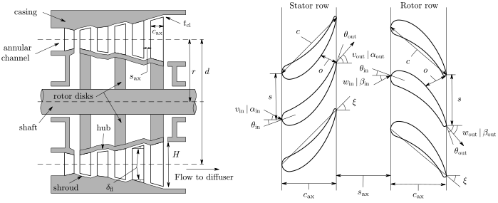

# AxialOpt
## Description

`AxialOpt` is a MATLAB tool for the mean-line design optimization of axial turbines.  The code was developed aiming at simplicity and ease of use. Some of the notable features of the code are listed below:

- Supports the mean-line design optimization of axial turbines with any number of stages.
- Supports several loss models to estimate the entropy generation within the turbine, including:
  - [Ainley and Mathieson](https://apps.dtic.mil/dtic/tr/fulltext/u2/a950664.pdf) (1951)
  - [Dunhan and Came](http://dx.doi.org/10.1115/1.3445349) (1970)
  - [Kacker and Okapuu](http://dx.doi.org/10.1115/1.3227240) (1982)
- Uses a one-dimensional diffuser model or a simplified isentropic flow model to compute the fraction of kinetic energy recovered at the exit of the turbine.
- Supports a wide range of working fluids, such as air, water, carbon dioxide, hydrocarbons, and refrigerants.
- Uses the equations of state of the [CoolProp](http://www.coolprop.org/) library to compute the thermodynamic properties of the working fluid.
- Uses the gradient-based algorithms of the [MATLAB Optimization Toolbox](https://se.mathworks.com/products/optimization.html) to find the optimal turbine configuration in a systematic way. 
- Offers plotting capabilities to visualize the geometry, thermodynamic diagrams, velocity triangles, and loss distribution of the designed turbines.
- Offers the possibility to export publication-quality plots by means of the [export_fig](https://github.com/altmany/export_fig) toolbox. Using this toolbox requires [ghostcript](https://www.ghostscript.com/) and [pdftops](http://www.xpdfreader.com/). See the installation instructions in the original repository.

<figure>
	 
</figure>

_Note: AxialOpt is not suited to estimate the performance of an existing turbine design under different operating conditions._

## Installation

In order to use `AxialOpt` you need a MATLAB installation and the MATLAB Optimization Toolbox. In addition you need to install CoolProp and interface it with MATLAB through Python. This may sound complicated, but it is not!

Check the step-by-step instructions below to learn how to interface MATLAB with CoolProp in a Windows operating system. The installation for Linux or Mac operating systems would be similar.

#### Step 1 - Download and install Miniconda

Download the [Miniconda](https://docs.conda.io/en/latest/miniconda.html) environment management system and follow the installation instructions.

#### Step 2 - Create a virtual environment and install CoolProp

Open a Miniconda terminal (look for "Anaconda Prompt" or "Miniconda3"). Once the terminal is open, type the following command to create a new virtual environment named `coolprop_env`:

```shell
conda create --name coolprop_env python=3.8
```

Don't worry if you are not familiar with the command window or with virtual environments, you only have to type two more commands before the installation is complete. Now that the environment is created, you can activate it. Just use the following command:

```shell
conda activate coolprop_env
```

Finally, type the following command to install CoolProp:

```shell
conda install CoolProp --channel conda-forge
```

That's it! Note that it was necessary to tell Miniconda that it should look for Coolprop in the `conda-forge` channel.

#### Step 3 - Interface MATLAB and Coolprop

Open MATLAB (or close and open it if it was already open) and type the following command to let MATLAB know where is the Python executable (python.exe) of the virtual environment that you have just created:

```matlab
pyversion C:\Users\rober\.conda\envs\coolprop_env\python.exe
```

Note that, in my case, the executable was located at `C:\Users\rober\.conda\envs\coolprop_env\`. You should replace this part with the correct path in your computer.

Good! You have installed CoolProp and interfaced it with MATLAB. Let's do a simple test to check if the installation was successful. We are going to use CoolProp to compute the saturation temperature of water at atmospheric pressure. Just type the following command in MATLAB: 

```matlab
py.CoolProp.CoolProp.PropsSI('T','P',101325,'Q',0,'Water')
```

If it does not throw and error and returns 373.1243 K, the installation was successful.

## Getting started

The best way to learn how to use `AxialOpt` is to open one of the [examples](examples/) and start playing around with the different parameters and settings. The examples have plenty of comments to guide the users and help them understand how the code works. You can use the example scripts as a template to start your own projects.

## Mathematical background

Check out our papers if you want to learn more about the optimization problem formulation and mathematical modeling behind `AxialOpt`:

- R. Agromayor and L. O. Nord (2019). [Preliminary Design and Optimization of Axial Turbines Accounting for Diffuser Performance](https://doi.org/
  10.3390/ijtpp4030032). *International Journal of Turbomachinery, Propulsion and Power* 4.3, pp. 1-32.
- R. Agromayor, B. Müller, and L. O. Nord (2019). [One-Dimensional Annular Diffuser Model for Preliminary Turbomachinery Design](https://doi.org/10.3390/ijtpp4030031). *International Journal of Turbomachinery, Propulsion and Power* 4.3, pp. 1-31. 

## License

`AxialOpt` is licensed under the terms of the MIT license. See the [license file](LICENSE.md) for more information.


## Contact information
`AxialOpt` was developed by [Roberto Agromayor](https://www.ntnu.edu/employees/roberto.agromayor) and of [Lars O. Nord](https://www.ntnu.edu/employees/lars.nord) at the [Norwegian University of Science and Technology (NTNU)](https://www.ntnu.no/). Drop us an email to [roberto.agromayor@ntnu.no](mailto:roberto.agromayor@ntnu.no) if you have questions about the code or you have a bug to report!


## How to cite?
You can use the following BibTeX entries if you want to cite `AxialOpt` in your work:

```bibtex
@article{Agromayor2019a,
    title = {{Preliminary Design and Optimization of Axial Turbines Accounting for Diffuser Performance}},
    author = {Agromayor, Roberto and Nord, Lars O},
    journal = {International Journal of Turbomachinery, Propulsion and Power},
    volume = {4},
    number = {3},
    pages = {1--32},
    year = {2019},
    doi = {https://doi.org/10.3390/ijtpp4030032}
}
```

```bibtex
@article{Agromayor2019b,
    title = {One-Dimensional Annular Diffuser Model for Preliminary Turbomachinery Design},
    author = {Agromayor, Roberto and M{\"u}ller, Bernhard and Nord, Lars O},
    journal = {International Journal of Turbomachinery, Propulsion and Power},
    volume = {4},
    number = {3},
    pages = {1--31},
    year = {2019},
    doi = {https://doi.org/10.3390/ijtpp4030031}
}
```
